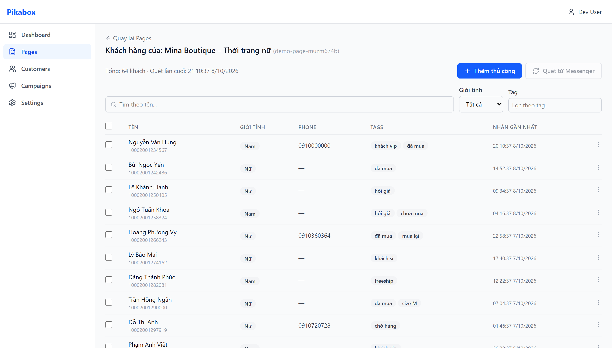
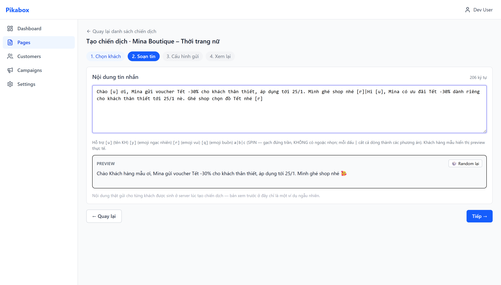
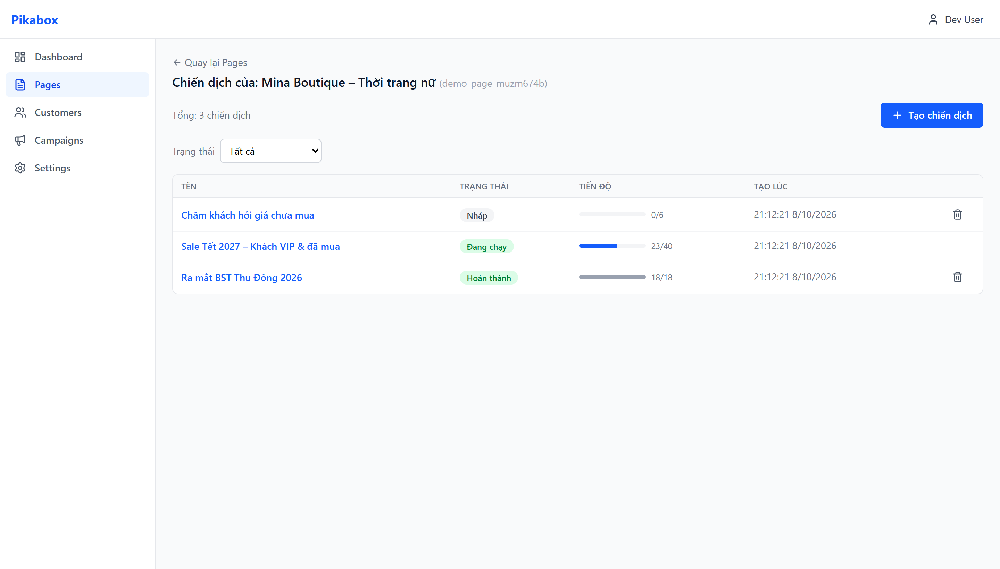
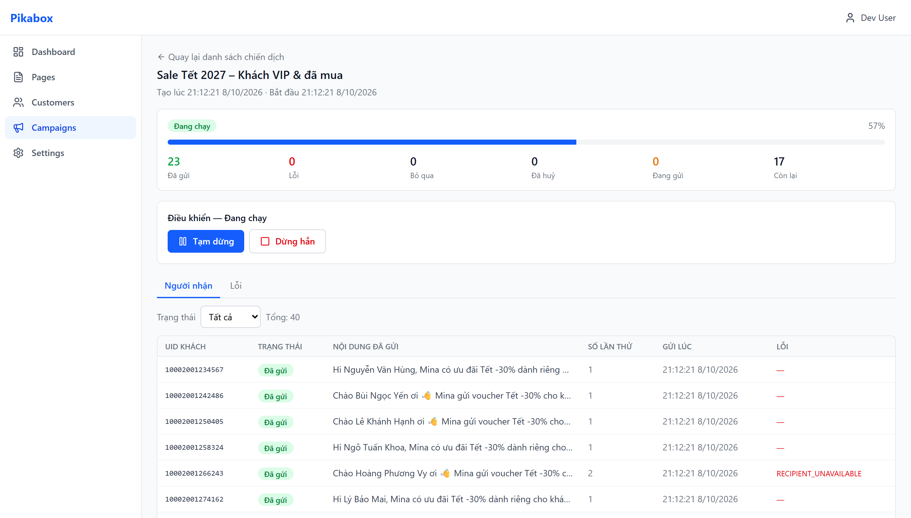

# PikaBox

**Messenger re-engagement for Facebook fanpages, built end-to-end with Claude Code.**

Live site: https://pikabox.tech · Contact: hungpv4@pikabox.tech · Ha Noi, Vietnam

This repository holds the public landing page. The product itself (backend, web app, Chrome extension) lives in a private monorepo; the numbers and excerpts below are taken from it and can be shown on request.

---

## What PikaBox does

Small online shops in Vietnam sell mostly through their Facebook fanpage inbox. A typical shop has 5,000 to 50,000 past customers sitting in that inbox and no practical way to follow up with them for a new collection or a Tết sale.

PikaBox turns the inbox into a tagged customer database and runs paced, deduplicated Messenger campaigns to those past customers, with account-safety controls built in.

| Feature | What it does | Status |
|---|---|---|
| Inbox scan → customer list | Extension scans a page inbox into a searchable list with every Facebook label, gender, phone and last-message date. Junk threads filtered. | Live |
| 4-step campaign wizard | Pick customers by label or gender, write one message with the customer's name and alternative wordings, set send order and pacing, review, launch. | Live |
| Server-rendered messages | Every message is rendered on the backend at campaign creation; what you preview is what gets sent. | Live |
| No duplicates, no spam loops | Stable per-message IDs make retries idempotent. Skip anyone contacted in the last N days. | Live |
| Realtime control | Sent, queued and failed counts update live. Pause, resume or stop at any time. | Live |
| Account circuit breaker | Failure-rate spike pauses every campaign on that account, probes carefully, resumes only when safe. A hard block pauses instantly. | Live |
| Multiple devices, one queue | Several Chrome instances pull work from one server queue with short leases; stale work is reclaimed. | Live |
| AI Pack (intent tagging, pre-send moderation, reply suggestions, customer summaries) | Claude API features on top of Starter. | Roadmap |

### Screens

| Customer database | Campaign composer |
|---|---|
|  |  |

| Campaign list | Campaign detail with live progress |
|---|---|
|  |  |

Screenshots use demo data.

### Architecture

```
Web dashboard (React)  ──HTTPS──▶  Backend (NestJS + PostgreSQL)  ◀──claim / report──  Chrome extension (MV3)
        │                                   source of truth:                                    │
        └── control events only ──▶  campaigns · message queue · leases ·          sends on the user's own
            (wake, pause, stop)      circuit breaker · stale-claim sweeper          browser session
```

- Backend owns every campaign and message. Extensions never hold a queue; they claim one message at a time with a 2-minute lease and report the result.
- Multi-device safety comes from `FOR UPDATE SKIP LOCKED` claims plus a sweeper that reclaims leases from devices that stop heart-beating.
- Per-account circuit breaker: failure threshold within a 5-minute window, cool-down, probe messages, auto-resume or manual force-resume.

---

## Built with Claude Code

The whole v2 codebase was planned, implemented, reviewed and tested through Claude Code, directed by the founder, over five months on a Claude Max 5x plan.

### Numbers from the private repo (as of 2026-10-08)

| Metric | Value |
|---|---|
| TypeScript source | 30,106 lines in 358 files |
| Packages | `backend` (NestJS, Prisma, PostgreSQL), `webapp` (React, TanStack Query), `extension` (Chrome MV3, WXT), `shared`, `e2e-browser` |
| Automated tests | 626 passing: backend 182 (E2E on a real PostgreSQL), shared 155, extension 158, webapp 131 |
| Test files | 66 |
| Real-browser E2E harness | Chrome for Testing + the extension + a real Facebook session, 8 scenario groups |
| Commits | 57 between 2026-05-08 and 2026-07-26 |
| Claude Code rule files kept in-repo (`.claude/rules/`) | 6 |
| Plan and spec files for Claude Code (`plans/pikabox-v2/`) | 14 (8 phase files, product spec, agent-mechanism spec, roadmap) |

### How the workflow runs

Every feature goes through the same loop, enforced by a rule file Claude Code reads on every session:

```
code  →  /ck:code-review  →  test bằng trình duyệt thật  →  update testcase vào plan
```

(code → automated code review → test in a real browser → record the test results in the plan)

- **Plan first.** Each phase has a plan file with requirements, files to touch, steps, success criteria and risks. Claude Code works from the plan and writes back what diverged.
- **Conventions as rules, not tribal knowledge.** `backend-api-conventions.md` fixes snake_case at the API boundary, stable error codes, Swagger decorators, tenant scoping on every service method. Claude Code follows it on every endpoint.
- **Review before done.** A code-reviewer agent reads every change; findings are verified by hand and either fixed or explicitly rejected with a reason in the plan.
- **Real-browser proof.** Unit tests are not enough for an extension talking to Facebook. The `e2e-browser` harness drives Chrome for Testing with the extension loaded and checks the database after each step. Results are recorded honestly in the plan, including cases that could not be verified.

### Excerpt from the phase 07 test record

| Scenario | Observed | Result |
|---|---|---|
| Agent registration | Web app mounts → extension registers → `execution_agents` row created | PASS |
| Inbox scan → DB | Scan real page inbox → `POST /customers/bulk` → customers in DB | PASS |
| Wake → claim → send | Runner claims, sends via real session, reports SENT, honours lease and delay, campaign auto-DONE | PASS |
| Pause | RUNNING → PAUSING → PAUSED, queued message stays queued | PASS |
| Resume | PAUSED → RUNNING → remaining message sent → DONE 2/2 | PASS |
| Stop | CANCELLED, remaining queued messages cancelled, none sent | PASS |
| Circuit breaker | 7 reported failures → account CIRCUIT_OPEN, campaign PAUSED with reason, banner + force-resume | PASS |

### Commit timeline (selected)

| Date | Commit |
|---|---|
| 2026-05-12 | feat(shared): port legacy template engine and timezone utils with test coverage |
| 2026-07-18 | feat(backend): implement Phase 01 Pikabox v2 backend skeleton |
| 2026-07-18 | feat(backend): API contract snake_case + rule conventions cho AI |
| 2026-07-19 | feat(backend): domain model + REST API cho account/page/customer/campaign |
| 2026-07-21 | feat(webapp): quản lý chiến dịch — danh sách, wizard 4 bước, chi tiết + tiến độ |
| 2026-07-21 | feat(rules): bắt buộc review và test trình duyệt sau khi code |
| 2026-07-22 | feat(backend): máy gửi kéo việc — claim/lease/report + bộ quét thu hồi |
| 2026-07-22 | feat(backend): bộ ngắt mạch theo tài khoản kênh (circuit breaker) |
| 2026-07-25 | docs(plan): phase 08 E2E backend verified 182/182 |
| 2026-07-26 | feat(e2e-browser): harness E2E trình duyệt thật + Facebook thật (8 nhóm, 6/6 PASS) |

Commit messages are in Vietnamese by rule; the rule file also fixes English for identifiers, error codes and conventional-commit prefixes.

### What Claude does next inside the product

The AI Pack is specified in the roadmap and is the next build: classify inbox threads by intent and auto-tag customers, flag risky wording before a message is sent, summarise a customer from chat history, and suggest replies in the shop's voice.

---

## This repository

Static landing page: `index.html`, `styles.css`, `assets/`. Served by GitHub Pages at https://pikabox.tech.
